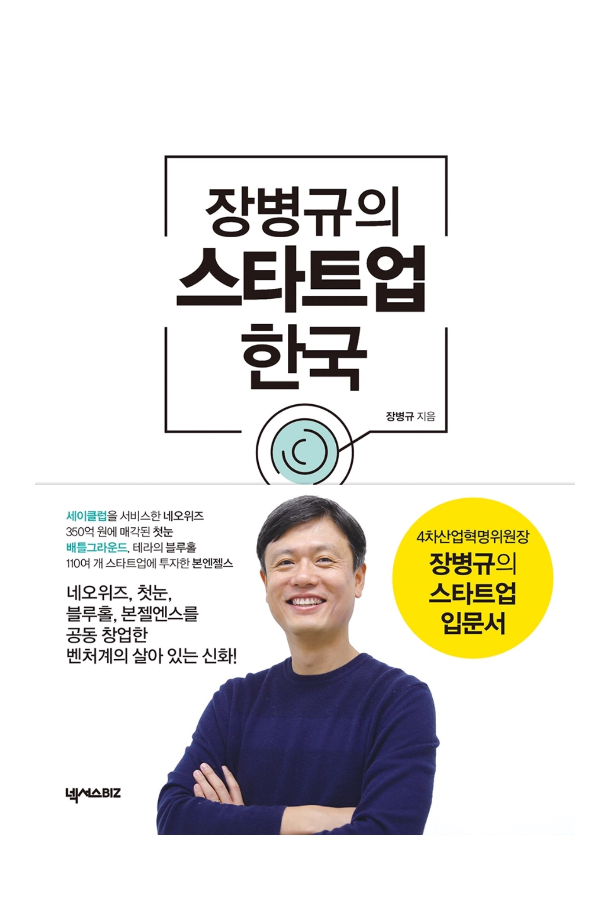

# 서평, 장병규의 스타트업 한국

> 읽은지 4-5일 됐다고 벌써 기억이 가물거리는걸 보니 역시 정리는 빠르면 빠를 수록 좋다.

## 궁금했다.

- 스타트업은 어떻게 운영되는가?
- 스타트업은 어떻게 시작할 수 있는가?
- 시작을 하게 되면 지분등은 어떻게 분배되는가?

### 이 책을 고른 이유

목차에 지분 얘기가 있는 책을 이 것 밖에 못 찾아서 이 책을 구매했다. 가격은 고려 대상은 아니었다. 가격도 쌌다. IT 창업자다.

## 결론적으로

이 책은 훌륭한 책이다. 가격도 싸다. 군더더기 없다. 경험담이다. 솔직히다. 케이스 스터디도 있다.

### 책의 저자

이 책의 저자인 장병규 대표에 대해 구두로는 많이 들어봤는데 얼굴은 책 표지를 통해 처음 알았다. 배틀그라운드의 성공, 블루홀 스튜디오 정도는 알았는데 호랑이 담배피던 시절의 **원 클릭** 으로 시작했다는 건 알지 못했다. 또 **네오위즈** 의 창업자다. 내 이전 직장 **부동산 다이렉트**의 투자자다.

### 공감

책을 읽으면서 초반에는 장병규 대표가 생각하는 스타트업, 뭐 그런 것들에 대해 상당히 **공감**을 많이 했다. 기술 서적외에는 사실 거의 읽질 않기 때문에  책 이란게 원래 이런 느낌을 받으면서 읽는 것인지는 모르겠으나 일전에 읽은 **소프트웨어 장인 정신** 이란 책도 상당히 공감을 많이 했다.

합리화의 귀신 같은 존재인 난 **소프트웨어 장인 정신** 을 읽는 순간 장인이었는데, 이번엔 인맥 없고 끈 없는 장병규 대표였다. :thinking: 일단 생각의 방향성을 느낄 수 있는데 그 점이 와 닿아서 좋았다.

책의 중간 중간, 해서 4개 정도의 창업자 케이스 소개가 있다. 모두 장병규 대표와 연관성이 있는 사람들로 지금 장병규 대표가 있는 본엔젤스의 투자를 받은 회사라던가, 하여 창업에 대한 스토리텔링이 있다. 재밌는건 여기서 3인칭 화법을 사용하는데... 나쁘지 않았다.

#### 케이스 소개

 이 부분이 꽤나 좋은데 교과서 마냥 케이스를 상당히 다른 것들로 구성해놔서 궁금했던 얘기를 예를 들어 전해 듣는 느낌이랄까? 이런 예에는 성공한 케이스도 있는 반면 망한 케이스도 있다. 이런 것들이 도움이 되려면 공감이 되야하는데 여기서 창업하는 사람들은 창업에 대해 아무 것도 모른체 창업하는 케이스도 포함되어 있었기에 더 도움이 됐다.(유명한 우아한형제들의 이야기도 있다.)

### 조언

조언에 내 감상은 필요 없을 것 같다. 굳이 조금 말하자면 창업자와 투자자, 그리고 예비(?) 선배로써의 경험에서 나오는 실질적인 충고가 있다. 굳이 책에 거짓을 이야기할 이유도 없겠지만 이러한 충고들에 신뢰성을 더 하는 몇가지 양념 :hot_pepper: 들이있다. 이 글은 주관적인 글이지만 이 부분은 매우 주관적이다.

- 배틀그라운드의 성공 이후 성공에 대한 분배를 이토록 하는 기업을 본적이 없다.
- 책 가격이 싸다(책으로 돈벌 생각은 없어보인다.)

공동 창업, 스타트 업의 성장 뭐 이런 내용은 책을 보는게 빠르겠다.

## 추천

값도 싸고 필요한 말만 들어있는 그런 책이다. 그냥 해주고 싶은 얘기를 하는 것 같은데, 듣는 입장에서 궁금한 것들을 많이 얘기해준다. 저자가 독자를 공감해주는, 그렇게 씌여진 느낌을 받았다. 좋은 책이다.