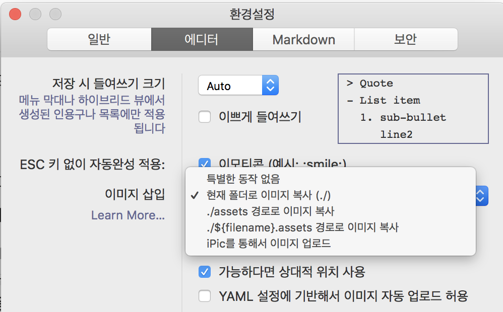

# Typora, Hexo 이미지 설정

> ⚠️ Typora와 Hexo의 소개는 이 글의 주제가 아니다. Typora 에 대한 소개는 [이전 글](http://blog.bglee.me/posts/2018/typora/) 을 참조한다.

> 마크다운 글 작성, 블로그 포스트, **Typora** 하나로 끝을 내자.

## 서문

생산성 때문에 **미디움** 으로 옮겨서 글을 작성한 것이었는데, 미디움의 웹 에디터가 그 다지 성능이 좋지가 않아서 다시 고민중이다.

대표적인 문제는 두가지다.

- 글 작성중 저장이 꼬였다고 리로드하라고 한다.
- 코드 하이라이팅이 매우 취약하다.

반면 여기서 쓰고 있는 Hexo는 지킬과 달리 쓸만한 테마가 그리 많지 않았다. 그렇다고 만들자니... "내가 그런 것 까지?" 하는 생각이 들고, 그나마 마음에 드는 테마를 골라도 시간이 지나면 질리기 마련이니, 여기서 또 시간이 소모된다. 글 생산에 집중하고자 했고 그래서 **미디움** 으로 옮기게 되었다.

그런데 여기서 가볍게 글을 쓰고자 하는 나의 마음과는 달리 **팔로우** 라는 시스템이 붙어 버리니 조금 부담스럽게 된 것도 사실이다. 많은 사람이 글을 읽으면 더 좋으니까 라는 마음도 있었지만,

그래서 좀 더 정리 안되면서도 개인적인 쏟아낼 공간이 필요해서 다시 이 곳을 활용하기로 했다.

# Typora :handshake: Hexo

Typora 라는 내가 써본 마크다운 에디터중 가장 강력하며 안정화되어 있다. Hexo 는 작성된 마크다운을 가지고 포스팅을 만들어준다.

그럼 여기서 소개하고자 하는, 해결하고자 하는 문제는 무엇인가?

### 이미지 첨부

이미지 첨부를 하게 되면 Typora 라는 친절하게도 몇가지 옵션을 제시한다. Hexo는 포스팅의 파일 명을 기반으로 동일 명의 디렉토리를 참조하여 이미지를 업로드하고 이를 참조한다.

```bash
.
├── cognito
│   └── federated_identities_logins.png
├── cognito.md
```

이런 형태다. 즉, `cognito.md` 는 `cognito` 의 참조를 통해야 디플로이시에 문제가 발생하지 않는다.

문제는 이 설정이 Hexo 의 설정과 맞지 않는다는데 있다. 



현재 폴더로 복사와 몇가지 프리셋이 준비되어 있는데 동일 폴더명을 선택할 수 없다. 그래서 플러그인을 작성하려다가 잠시 멈추고 몇 가지 문서를 검색해서 참조하니 간단한 해결책이 있었다.

### typora-copy-images-to:

포스팅 글에는 마크다운 문서 상단부에 **YAML** 포맷으로 메타 정보를 기입할 수 있는데 이 메타 정보는 **HTML** 을 생성하는데 관여하고 글 자체에 영향을 주지는 않는다.

이런 방식이 블로그 포스팅에 관련해서는 일반적이기 때문인지 이를 활용해서 Typora 에 설정을 주입할 수 있다. 플러그인도 아니고  기존 환경을 이용하는, 이건 뭐 매우 신박한 방식이다.

결론적으로는 `typeora-copy-images-to` 속성을 주입놓으면 Typora 강 이를 읽고 설정보다 우선시하여 적용한다. 확인은 드래고 이미지를 넣게 되면 `typora-copy-images-to` 에 의해 설정된 디렉토리를 읽어 자동으로 복사가 이루어지고 그에 따른 경로도 수정되어진다. :+1:

### scaffolds

Hexo 의 디렉토리 구조에 `scaffolds` 라는 디렉토리가 존재한다. 이 곳을 열어보면 일반적으로 `draft.md`, `page.md`, `post.md` 가 들어있다. 이를 레이아웃이라고 하는데 **cli** 를 통해 포스트(파일)를 기본 구조와 함께 생성할 수 있다.

문서를 참조하면 기본 레이아웃은 **post** 다. 즉 `hexo new <filename>` 은 **post**, `post.md` 파일을 참조해서 생성된다.

#### `post.md`

```bash
$ cat scaffolds/post.md
---
title: {{ title }}
date: {{ date }}
typora-copy-images-to: {{ title }}
tags:
---
```

파일을 열어 보면 위와 같이 되어 있다. `typora-copy-images-to` 속성을 눈 여겨 보자. 그럼 아까 포스트를 생성하고자 했던 명령어에 실질적으로 파일 이름을 부여해보자. 파일 이름은 타이틀도 함께 매칭된다.

```bash
hexo new typora-hexo
INFO  Created: ~/workspace/src/github.com/deptno/blog/source/_posts/typora-hexo.md
✨  Done in 1.30s.
```

파일이 생성되었다.

```markdown
---
title: typora-hexo
date: 2018-07-17 14:48:06
typora-copy-images-to: typora-hexo
tags:
---
```

파일을 열어보면 위와 같다. 우리가 주목해야할 것은 `typora-copy-images-to` 속성이다. 뒤에는 `{{ titlle }}` 을 매칭해 뒀기 때문에 값은 파일명과 같이 `typora-hexo` 다.

때문에 이제 그냥 글을 작성하면서 이미지를 드래그해서 넣으면 알아서 `typora-hexo/<image-file>` 형식으로 삽입되게 되며 복사 또한 자동으로 이루어져 이미지에 대한 고민에서 해방된다.

### 터미널에서 Typora 를 통해 markdown 열기

Hexo 에서 템플릿(scffold)을 통해 파일을 생성하기 위해서는 **terminal** 을 이용해야하므로 Typora 또한 터미널에서 열 수 있어야 작은 스트레스를 면할 수 있다.

#### alias

Typora 의 공식 문서에 칠절하게 나와있어서 한줄 복사해서 사용하는 쉘의 설정파일에 추가하면된다.

```bash
alias typora="open -a typora"
```

난는 개인적으로 **zsh** 을 이용하고 있으므로 `~/.zshrc` 파일이다. 이렇게 하면 쉘에서 파일을 생성한후 타이포라를 통해 바로 열 수 있다. `typora typora-hexo.md` :ram:

---

## 참조

- https://hexo.io/ko/docs/writing.html

- https://support.typora.io/Use-Typora-From-Shell-or-cmd/
- https://support.typora.io/Images/#when-insert-local-image