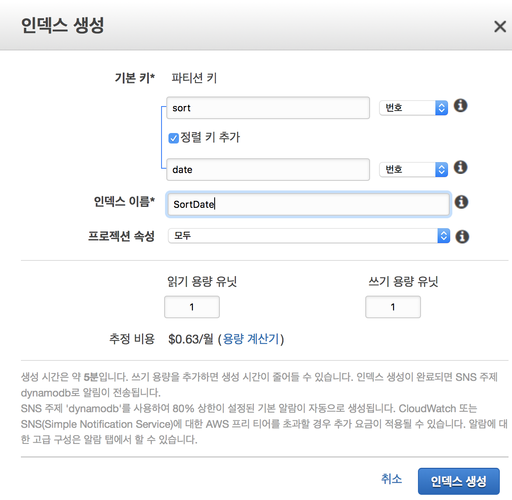

## AWS DynamoDB query order

> **미션** 전체 데이터를 최근순으로 가져온다. :ram:

#### 다이나모디비의 키 구성

다이나모디비는 필수적인 해시키와 추가적으로 정렬키를 할당해서 기본키를 이룰 수 있다.

#### Scan vs Query

스캔은 모든 항목을 읽어온다. 그 중간에 필터를 걸어서 원하는 것 만을 뽑아 올 수 있지만 기본적으로 모든 다큐먼트(레코드)를 검색하기에 그만큼의 비용이 소모된다.

필터는 가능하지만 **정렬**은 가능하지 않ㄴ다.

### Query

때문에 정렬을 위해서는 Query를 통해서 데이터를 가져와한다. 쿼리는 기본인자로 해시키를 받는다. 정렬은 정렬키를 통해서 이루어지는데 해시키를 주게되면 데이터셋이 한정되므로 **데이터 전체**에 대한 정렬을 원하는 내게 원하는 동작은 아니다.

때문에 이를 위해선 꽤 번거로운 작업을 필요로 한다. 내가 찾은 방법은 **GSI**를 이용하는 방법이다. 인덱스의 형식에는 GSI와 LSI가 존재한다.

#### Global Secondary Index(GSI) vs Local Secondary Index(LSI)

GSI와 LSI의 차이는 기본적으로 해시키를 테이블 정의시의 해시키를 그대로 활용하고 정렬키만 바꾸는가 아니면 해시키까지 다시 정의하는 가에 대한 차이가 있다.

### Query :two_women_holding_hands: GSI

다시 쿼리로 돌아와서 미션을 해결하고자 GSI를 생성했다. 쿼리에서는 기본적으로 해쉬키를 건내야한다. 쿼리를 날리기 위한 데이터셋을 정의하는 행동인데 전체로하므로 어글리하게도 상수 값을 속성하나에 할당하기로 한다. 예를들어 `sort` 라는 속성을 해시키로 할당하고 모든 도큐먼트(record)에 대해서 동일한 값을 줘서 전체를 데이터셋으로 만드는 내용이다.

#### GSI 생성



그럼 GSI를 생성하기 위해 다이나모 테이블에서 **인덱스**를 선택하고 GSI를 생성한다. 해쉬값에는 위에서 얘기한데로 `sort`라는 이름을 주고 타입을 `번호`로 설정했다. 바이너리로 설정하니 `aws-sdk`의 `DynamoDBClient` 에서 접근하기가 어려웠다.

정렬키에는 정렬의 기준이 되고자 하는 속성을 선택해야한다. `createAt` 등등 사용하고 있는 이름이 있을거다. 난 `date` 였다. 때문에 `date` 를 넣고 그에 맞는 속성을 줬다. 난 `번호` 였다.

생성에는 5분정도 시간이 걸렸던 것 같다. 기존 데이터의 양과 프로비저닝된 용량에 따라 시간이 더 소모될 수 있다.

인덱스의 이름은 편할 걸 넣어주면된다. 아래서 작성 할 코드에서는 **PascalCase** 형식으로 이름을 작성했다.

#### 데이터를 추가

데이터를 추가할때 `sort: 0` 이 반드시 추가되야한다. 그래야지만 인덱싱이 가능하다. `0`은 우리가 `번호` 타입을 설정했고 모든 데이터를 묶기 위해 동일한 숫자로 선택했을 뿐 다른 의미는 없다.

기존 데이터들이 있다라면 모두 업데이트를 쳐줘야한다. :cloud_with_lightning_and_rain:

#### Code

```typescript
import * as AWS from 'aws-sdk'

enum EDyanmoDBTable {
  User    = 'User',
  Post    = 'Post'
}
enum EDyanmoDBGSI {
  SortDate = 'SortDate'
}

const ddbClient = new AWS.DynamoDB.DocumentClient()

export const queryPosts = () => {
  return ddbClient
    .query({
      TableName: EDyanmoDBTable.Post,
      IndexName: EDyanmoDBGSI.SortDate,
      ScanIndexForward: false,
      KeyConditionExpression: "#sort = :sort",
      ExpressionAttributeNames: {
        "#sort": "sort",
      },
      ExpressionAttributeValues: {
        ":sort": 0,
      },
    })
    .promise()
}
```

##### ScanIndexForward

이 파라메터를 통해 오름차순(`true` default)과 내림차순(`false`)이 결정된다. 정렬은 정렬키를 통해서 이루어지므로 코드에는 명시되지 않았지만 `IndexName` 을 통해 `date` 정렬키를 보유한 인덱스를 가리키고 있다.

### :warning: 주의할 점

테이블이 생성되었고 GSI를 생성하기 전에 `sort: number` 형식으로 데이터를 이미 생성했다고 가정해보자. 아무래도 `DynamoDBClient` 의 `put`을 통하면 `Binary` 형식 입력이 되지 않는 것으로 보이는데 때문에 `sort: number`  가 도큐먼트에 들어간 상태에서 GSI를 `sort: binary` 형식으로 생성하게 되면 이 데이터들이 인덱싱이 되지 않는다.

또한 더 골때리는 것은 애매 모호한 에러를 내면서 `query` 도 동작하지 않으니 주의하자.

---

:information_desk_person: 말을 다소 혼용해서 했는데 `number` 는 번호, `binary` 는 이진수를 의미한다.