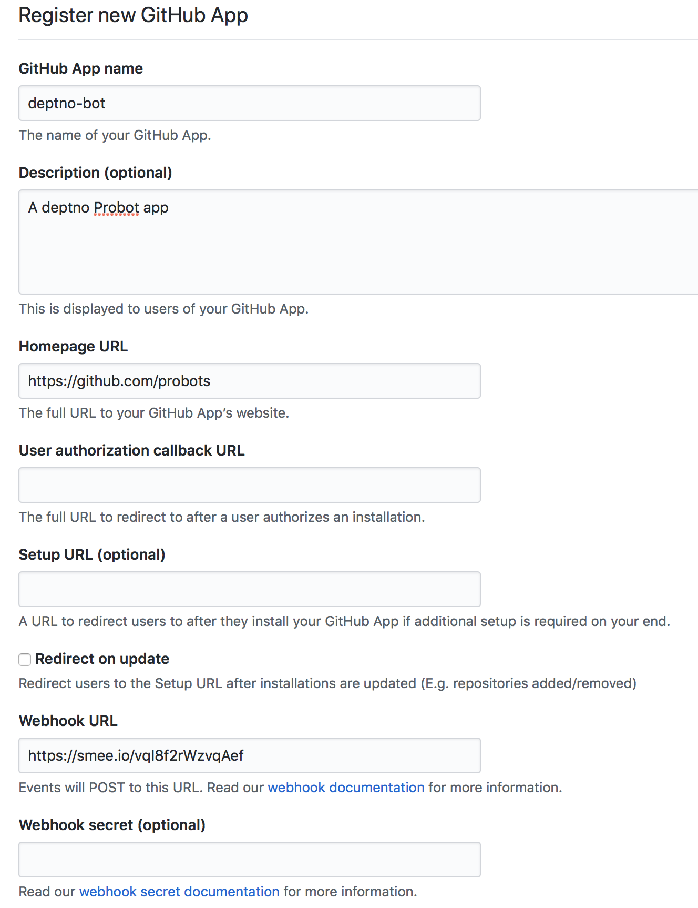
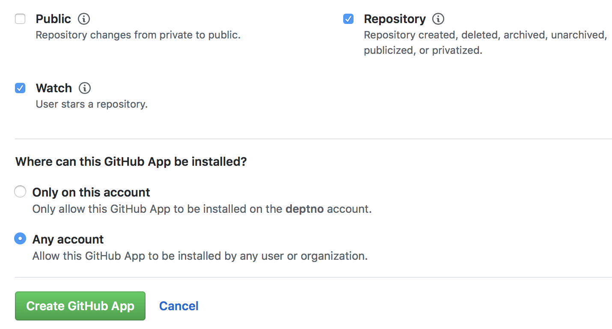
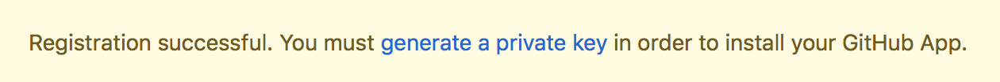
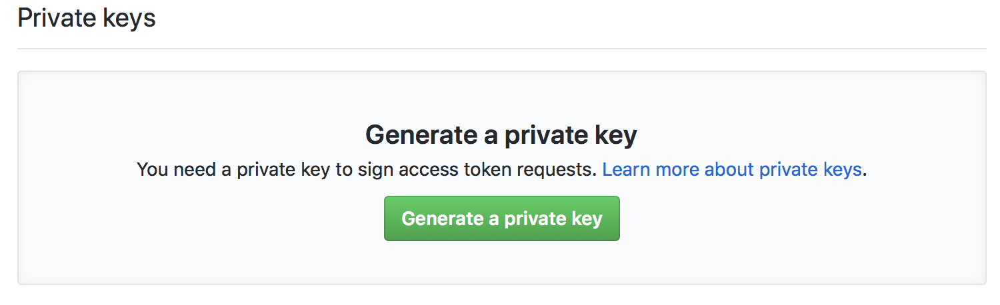
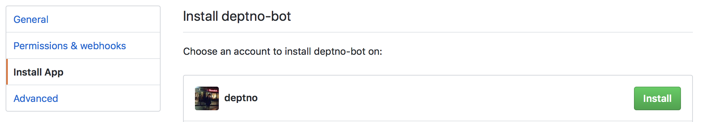
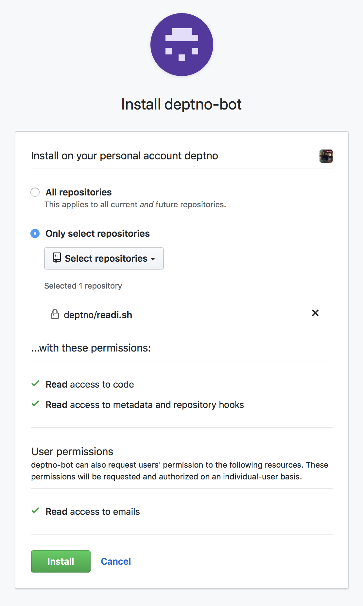
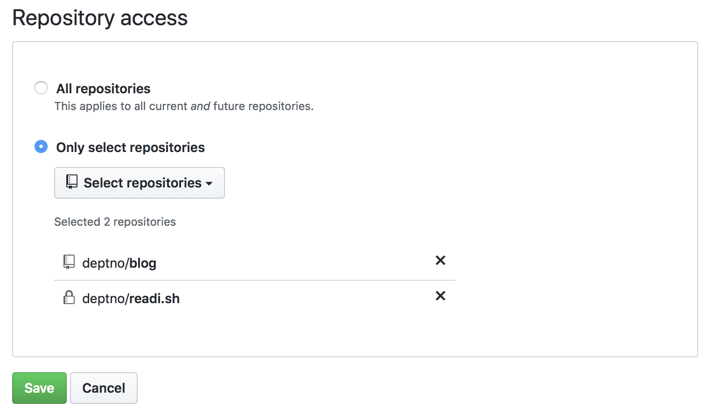
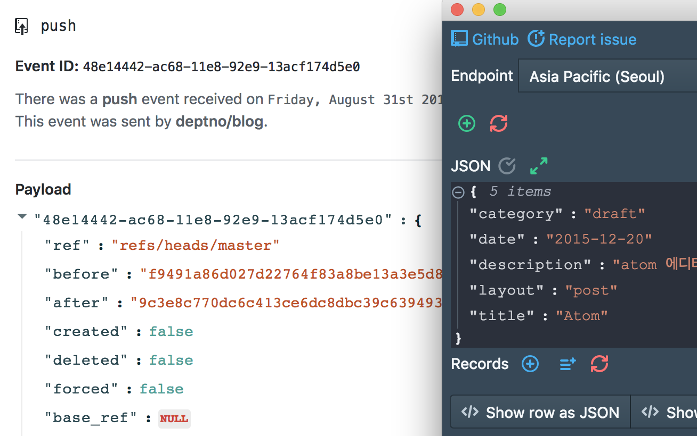

## 프로봇

프로봇은 깃헙 앱을 만들기 위한 프레임워크다. `yarn`, `typescript` 세팅을 기준으로 진행한다. 빠르게 튜토리얼을 훑는 것 그 이상도 이하도 아니다. 설치부터 시작하자.

### 설치

```bash
yarn init -y
yarn add -D create-probot-app
yarn create probot-app --typescript deptno-bot
```

프로봇은 타입스크립트로 짜여져 있으며 타입스크립트 템플릿을 지원한다 `--typescript` 옵션을 주면 타입스크립트로 생성된다.

잘되면 아래와 같이 결과가 나온다.

```bash
yarn create v1.9.4
[1/4] 🔍  Resolving packages...
[2/4] 🚚  Fetching packages...
[-------------------------------------------------------------------------------------------------------------] 0/291(node:30558) [DEP0005] DeprecationWarning: Buffer() is deprecated due to security and usability issues. Please use the Buffer.alloc(), Buffer.allocUnsafe(), or Buffer.from() methods instead.
[3/4] 🔗  Linking dependencies...
[4/4] 📃  Building fresh packages...
success Installed "create-probot-app@2.3.0" with binaries:
      - create-probot-app
[###########################################################################################################] 296/296Let's create a Probot app!
? App name: deptno-bot
? Description of app: A Probot app
? Author's full name: Bonggyun Lee
? Author's email address: deptno@gmail.com
? Homepage: https://bglee.me
? GitHub user or org name: deptno
? Repository name: deptno-bot
created file: /Users/bglee/tmp/probot/deptno-bot/.env.example
created file: /Users/bglee/tmp/probot/deptno-bot/.gitignore
created file: /Users/bglee/tmp/probot/deptno-bot/.travis.yml
created file: /Users/bglee/tmp/probot/deptno-bot/CODE_OF_CONDUCT.md
created file: /Users/bglee/tmp/probot/deptno-bot/CONTRIBUTING.md
created file: /Users/bglee/tmp/probot/deptno-bot/LICENSE
created file: /Users/bglee/tmp/probot/deptno-bot/README.md
created file: /Users/bglee/tmp/probot/deptno-bot/jest.config.js
created file: /Users/bglee/tmp/probot/deptno-bot/package.json
created file: /Users/bglee/tmp/probot/deptno-bot/tsconfig.json
created file: /Users/bglee/tmp/probot/deptno-bot/.github/CODEOWNERS
created file: /Users/bglee/tmp/probot/deptno-bot/src/index.ts
created file: /Users/bglee/tmp/probot/deptno-bot/test/index.test.ts
Finished scaffolding files!

Installing Node dependencies!
npm WARN deprecated istanbul-lib-hook@1.2.1: 1.2.0 should have been a major version bump

> dtrace-provider@0.8.7 install /Users/bglee/tmp/probot/deptno-bot/node_modules/dtrace-provider
> node-gyp rebuild || node suppress-error.js

  ACTION binding_gyp_ndtp_target_build_ndtp .
  TOUCH Release/obj.target/ndtp.stamp

> fsevents@1.2.4 install /Users/bglee/tmp/probot/deptno-bot/node_modules/fsevents
> node install

[fsevents] Success: "/Users/bglee/tmp/probot/deptno-bot/node_modules/fsevents/lib/binding/Release/node-v64-darwin-x64/fse.node" already installed
Pass --update-binary to reinstall or --build-from-source to recompile

> nodemon@1.18.4 postinstall /Users/bglee/tmp/probot/deptno-bot/node_modules/nodemon
> node bin/postinstall || exit 0

npm notice created a lockfile as package-lock.json. You should commit this file.
added 994 packages from 638 contributors and audited 19455 packages in 17.196s
found 0 vulnerabilities

Done! Enjoy building your Probot app!
✨  Done in 35.46s.
```

이제 디렉토리로 진입해보자. `yarn create` 를 통해 생성했는데도 불구하고 왠 `package-lock.json` 이.. :thinking:

### smee.io 설정

웹훅을 받으려면 외부에서 접근 가능한 `url` 이 필요한데 공식 문서에 `smee.io` 가 언급되어있다. `ngrok`, `localtunnel.me` 등도 있는데 레코딩 기능과 그를 기반으로 이전 이벤트를 다시 쏴주는등 편리한 기능을 제공해주는 것 같다. 매우 좋다. :laughing:

https://smee.io 에 접속해서 채널을 생성하면 `url` 이 나오는데 이 `url` 을 `.env` 파일에 넣어준다. 아래와 같은 모습이된다.

```bash
WEBHOOK_PROXY_URL=https://smee.io/vqI8f2rWzvqAef
```

#### 프록시 연결

프록시는 방금 생성했으니 이 곳에 접속해서 훅을 로컬로 돌려야한다.

```bash
npm install --global smee-client
smee -u https://smee.io/vqI8f2rWzvqAef
```

글로벌 인스톨은 `npm` 을 통해서 하고 있어서 `npm` 을 통해 설치했다.

`smee -u {PROXY_URL}`  을 실행해서 프록시에 연결한다. `PROXY_URL` 은 당연히 생성한 채널의 `url` 이다.

### 깃헙 앱 생성

https://github.com/settings/apps/new 에 들어가서 이제 새 `Github App` 을 생성해보자.

`Webhook URL` 에는 `smee.io` 를 통해 생성한 `URL` 을 들고와야한다.

:warning: `Webhook secret` 이 옵셔널로 되어 있지만 반드시 줘야한다. `.env` 파일과 짝을 이뤄야하므로 `development` 를 넣어준다.



퍼미션이나 받고자 하는 훅은 본인이 선택하면 된다. `Watch` 를 통해 스타를 받는 것이 테스트하기 편해 보여 아래와 같이 설정했다. 또 타인이 설치할 수도 있도록 `Any acount` 를 선택했다.

:information_desk_person: 이 부분은 원하는 이벤트에 따라 달라지니 필요한 이벤트는 선택해두자.



그럼 상단에 키를 생성하라고 배너가 뜬다. 링크를 눌러 생성하자



`Generate a private key` 를 누르면 바로 `pem` 파일이 다운로드 되는데 이를 프로젝트 루트(`/`) 에 넣어두자 이름은 상관없이 인식하겠다고 문서에 적혀있다.



### 깃헙 앱 설치

그럼 메뉴에서 `Install` 을 할 수 있게 되며 해보자.



아까 설정한 대로 퍼미션을 요구한다 `All repositories` 는 부담스러운으므로 테스트하기 편한 레포지터리를 넣었다.



블로그 글을 쓰면서 함께 테스트하고자 `deptno/blog` 레포를 추가적으로 선택하고 `Save` 했다.



앱 생성후 나오는 ID는 `.env` 파일의 `APP_ID` 에 넣어줘야한다.

## 개발

이제 깃헙 앱도 생성하고 했으니 실제 코드를 작성해보자. 일단 모든 이벤트에대해서 로그를 찍는다.

```typescript
module.exports = (app) => {
  app.on(`*`, async context => {
    context.log({event: context.event, action: context.payload.action})
  })
}
```

타입스크립트의 경우 `yarn build` 를 통해 빌드를 실행해야만 `yarn dev` 가 성공한다.

```bash
yarn build
yarn dev
```

문서를 따라가다가 아차했는데 서버를 켜보니 `smee.io` 쪽에서 이벤트를 킵하고 있다가 순차적으로 보내주는 것으로 보인다. 때문에 이전에 앱을 설치하면서 했던 이벤트는 모두 기록되어 있다.

```bash
$ nodemon --exec "npm start"
[nodemon] 1.18.4
[nodemon] to restart at any time, enter `rs`
[nodemon] watching: *.*
[nodemon] starting `npm start`

> deptno-bot@1.0.0 start /Users/bglee/workspace/src/github.com/deptno/probots/packages/deptno-bot
> probot run ./lib/index.js

14:37:55.588Z  INFO probot: Yay, the app was loaded!
14:37:55.693Z  INFO probot: Forwarding https://smee.io/vqI8f2rWzvqAef to http://localhost:3000/
14:37:55.695Z  INFO probot: Listening on http://localhost:3000
14:37:56.411Z DEBUG github: GitHub request: GET /app/installations - 200 OK (installation=undefined)
  params: {
    "per_page": 100,
    "baseUrl": "https://api.github.com",
    "request": {
      "timeout": 0
    }
  }
14:37:56.641Z  INFO probot: Connected https://smee.io/vqI8f2rWzvqAef
14:37:56.981Z DEBUG github: GitHub request: POST /installations/:installation_id/access_tokens - 201 Created (installation=312381)
  params: {
    "installation_id": "312381",
    "baseUrl": "https://api.github.com",
    "request": {
      "timeout": 0
    }
  }
14:37:57.896Z DEBUG github: GitHub request: GET /installation/repositories - 200 OK (installation=312381)
  params: {
    "per_page": 100,
    "baseUrl": "https://api.github.com",
    "request": {
      "timeout": 0
    }
  }
```

이제 선택했던 레포에 스타를 줘보자.

```bash
14:57:26.636Z DEBUG probot: Webhook received
  event: {
    "event": "watch.started",
    "id": "02398ac0-ac65-11e8-9164-6e525ac149cd",
    "installation": 312381,
    "repository": "deptno/readi.sh"
  }
14:57:26.643Z  INFO event:  (id=02398ac0-ac65-11e8-9164-6e525ac149cd, event=watch, action=started)
14:57:26.644Z  INFO http: POST / 200 - 8.38 ms (id=160f481c-e579-4c1a-a3e9-6dc3dd61d266)
14:57:26.644Z  INFO probot: POST http://localhost:3000/ - 200
14:57:26.645Z DEBUG probot: Webhook received
  event: {
    "event": "watch.started",
    "id": "02398ac0-ac65-11e8-9164-6e525ac149cd",
    "installation": 312381,
    "repository": "deptno/readi.sh"
  }
14:57:26.648Z  INFO event:  (id=02398ac0-ac65-11e8-9164-6e525ac149cd, event=watch, action=started)
14:57:26.649Z  INFO http: POST / 200 - 3.96 ms (id=160f481c-e579-4c1a-a3e9-6dc3dd61d266)
```

:thinking: 왜 이벤트가 중복으로 오는지는 모른다. `smee.io` 문제이리라... 일단 확인했다.

:information_desk_person: 이벤트를 로깅하려고 `context.log(JSON.stringify(context))` 등을 사용했으나 `smee.io`가 친절하게 다 보여준다.



반갑게도 [다이나몬](https://github.com/deptno/dynamon) 만들때 그 `JSON view` 다. :slightly_smiling_face:

여기서 기약은 없지만 1차를 마친다. 개인적인 정리중에 가장 기억안나는게 셋업이라 이 부분을 정리했다. 첨언하자면 `context` 객체에 `github` 을 통해 인증된 권한을 가지고 이슈등을 생성할 수 있다.(맞는 퍼미션에 맞게)