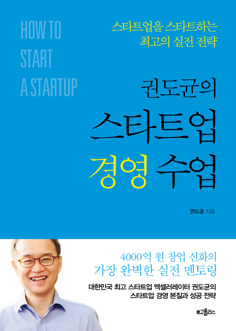

# 서평, 권도균의 스타트업 경영 수업

> 이번엔 스타트업의 경영에 대해 알고 싶어 이 책을 선택했다.

**경영** 에 대해 무지하기 때문에 사기전에 경영이 문과인지 이과인지 부터 검색했다. :ram: 그냥 말로 풀어진 책이었다. 수치나 이런게 나올 수도 있겠다 했었는데 그냥 읽을 수 있는 책이었다. :laughing: 역시 좋은 책이고 뭐라도 읽어야하는 나에게 또 지식과 경험을 줬다.

### 구성

무려 12챕터에 챕터당 10개정도의 소 주제를 가지고 이루어져있다. 필요한 부분만 찾아보기에 좋을 것 같고 저자의 경험을 위주로 씌여져있다.

### 내용

원론적이고 바른 얘기가 많이 쓰여져 있다.

### 공감

아래는 주인공이 나구나 (하아...)🍶 하면서 읽은 부분들 중 몇가지다.

#### 기업가 정신의 네가지 특징

저자는 보통 기업가 정신이라 하면 **피상적이고 모호하며 사람마다 다르게 해석되는** 말로 정의 하고 있다고 말하며 자신이 본 네가지를 말한다.

> 낙관주의

낙관주의에 대해 저자는 미래 지향성을 이야기한다. 현재보다 미래에 배팅하고 움직인다. 저자의 생각에 첨언을 하자면 공무원이 안정적이라 하여 지금 공무원을 준비하는 것은 사람에 따라서 미래에도 그 일이 가장 안정적이라 생각하기 배팅하는 것일 수 있다. 그런데 여기서 이미 안정적을 추구한다는 모순이 있다. 이경우는 미래 지향적이지 않다. 현재에서 발전하지 않을 것이라 생각하는 것이므로, 보다 나은 내일에 낙관한다.

> 주도성

주도성이라 한다면 누구나 **"나는 주도적인데?"** 할 수 있다. 저자는 예를 들어 설명한다. 금융 기관보다 자신이 직접 돈을 관리하는 것. :smile: 직접 경기에 뛰어 들어 흐름을 바꾸고자 하는 사람들이다.

> 책임감

주도성과 연관성이 깊어 보인다. 주어진 상황을 타박하지 않고 경기를 뛰는 선수처럼 심판의 오심도 경기의 일부인 것을 받아들인다. 저자는 일본 경영 컨설턴트 **하마구치 다카노리** 의 말을 인용한다.

"경영자는 눈이 내리는 것도 내 책임이라고 말해야한다."

> 결과중심적 사고

기업가는 행동하는 사람이다. 경영을 통해 **경제적 성과** 를 실체화 한다. 몽상가가 아니다. 수필가도 아니다.

#### 시작은

가능한 부담 없는 상태를 유지해야한다. 매출과 자본이 없는 상태에서의 고용, 사업자 등록, 의리와 팀의 오해등이다.

#### 채용

채용은 너무도 중요하다. 저자는 **사람은 변하지 않는다** 라는 가정을 여러 인용을 통해 말하며 그만큼 중요하다 이야기한다. 채용은 **일을 얼마나 잘 하느냐** 보다 내가 만드려는 문화를 **보존할 수 있는가?** 에 더 초점을 맞춰야한다고 말한다. 특히 초반엔

---

#### 비즈니스의 터

나는 돈이 내게 잠깐 흐르게 하는 것이라 생각하고 그 돈의 물줄기가 나에게도 오도록 강 근처에 땅을 파서 내 근처에도 흐르게 한다는 생각을 주로했었는데 저자도 비슷한 표현을 했다. 아이디어에서도 비슷한 생각을 볼 수 있었는데 대충 이런 거다.

뭔가 자신이 대단한 아이디어를 생각해냈다고 생각하고 취할 수 있지만 그 아이디어의 작동 여부는 고객에 의해서 판단된다는 것이다. 저자는 **흐르는 강물에 배를 띄워라**  라고 말을 한다.

사업 아이템은 고객들이 필요로하는 그 곳에 생성하는 것이지 자신이 시장을 만들고나면 사람이 오는 그런게 아니라는 뜻이다. 비슷한 생각을 가지고 있다. 난 이런 생각을 **니즈의 자연 발생** 이라고 말하곤 한다. 예를 들면 이런거다.

> 뭘 지원하려고 하면 주민등록등본을 스캔해서 보내란다.

그럼 이걸 주민센터가서 발급하고 스캔해서 메일로 보내는데 왜이렇게 불편하게 하는건가? 한참 이전에 발전된 인증 기술을 이용해서, 서비스에 접속해서 회사에서 받을 수 있도록 인가해주면 회사에서 직접 출력하게 하면 누구에게 제출되었는지까지 추적되고, 더 투명하고, 더 편하지 않은가?

많은 사람들이 고통받고 있는 것, 필요로 하는 곳에 사업을 트면된다. 하고자 하는 것을 하고 사람들이 사용하길 바라는 것이 아니다.

#### 지표

책에서 **지표** 의 중요성을 설명한다. 근데 포커스는 측정이 아닌 선택이다. 무엇을 지표로 선택하는지는 고객의 반응을 어떻게 해석할지, 이해할지에 대한 것이기 때문에 매우 중요하며 경영자 본인이 판단해야한다.

이 부분이 "호오?" 하면서 봤는데, 서비스를 하면서 중요한 데이터를 뽑아내고 수치화하고 이걸 다시 적용하는 사이클을 갖는 시스템(자동화)을 만드는 것, 이 부분이 엔지니어로써 매우 탐나면서도 수긍이 가능 부분이었다. 사실 대부분의 회사에서 이미 하고 있을텐데 생각없이 애널리틱스 하나 뿌려놓고 있는게 아니라 지표 자체도 비즈니스마다 필요한 것을 제대로 설정해서 그를 달성하는 것, 이것은 중요하고 재밌을 것 같다.

#### 팀

저자는 다른 사람의 글도 많이 인용하는데 이 부분이 사실 궁금했다. 현실적이면서도 초기 팀을 구성하며 지분을 어떻게 할지, 지금 두권째 읽는 것인데 이에 대한 디테일한 수치는 나오지 않는다. 초기에 창업멤버끼리 C레벨을 구성하는데 실력이 거기에 미치지 못한다는 걸 깨달았는데 어떻게 행동해야 할 것인지, 그런일이 벌어지게 둘 것인가 등 창업을 해보곤 알수 없는 베일을 안을 잠시 들여다 볼 수 있었다.

#### 계약

계약도 창업 경험이 없는 사람에게는 블랙박스인데 이 부분에 대해서도 꽤나 갈증을 풀어준다. 연봉 협상이랑 다를바가 없어보인다. 역시 최고의 협상카드는 **"안할래요"** 인가 ㅋㅋ

### 요약

개인 정리라 두서가 없다. 한번읽고 서머리 할 분량은 아니었다. 좋은 책이고 궁금한 걸 말해준다.  내용이 꽤 되는데다가 같은 류의 생각을 가진 것 같아 멍한 상태로 읽으면 기억에 남지 않는다. 공감을 많이해서 당연한말이 많아서 그런 것 같은데, 난 옳은 말이기 때문에 당연한 말이라고 생각한다, 다시 한번 되새길 수 있는 시간을 갖게 하고, 경험에서 나오는 실질적인 조언을 해준다.

저자를 조금 찾아보니 최근 인터뷰에 왜 한국에선 유니콘이 안나오느냐 묻자. 경영이 문제라 한다.

저자가 책에서 쉽게 풀어쓴 것인지 모르겠으나 경영은 특별한 학문 같은게 아니었다. 뭐랄까 회사 생활 하는 방법처럼 회사  굴리는 타이쿤 게임 공략본 같은...