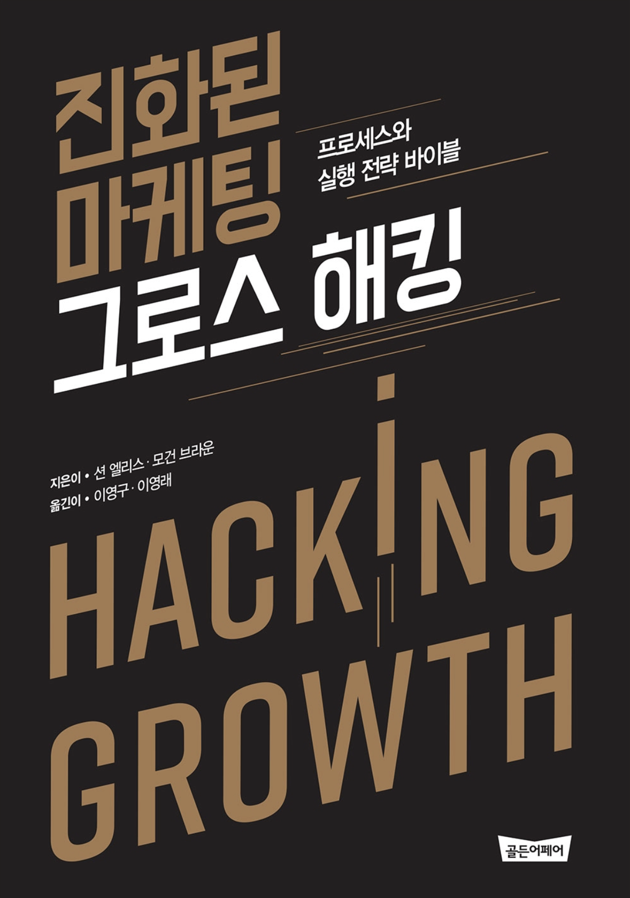

초반을 제외하고는 읽는 내내 상당히 괴로웠다. **그로스 해킹** 이었구나 라고 충분히 이해할 수 있었음에도 불구하고 너무나도 반복적이라 읽은 글이 5초 이후에 기억이 안나 같은 부분을 계속 읽은 것 같다. 책 자체는 그로스 해킹이 적용되지 않은 것 같아 아쉽다.

**그로스 해킹** 은 용어 자체가 마케팅적으로 훌륭하게 정립됐다. 용어 자체만으로 관심을 끌기에 충분하다.

## 그로스 해킹

그로스 해킹은 정의를 한번에 내리기에는 너무 광범위 하다. 추적 데이터를 기반으로한 분석, 실험 설계, 적용, 수정 정도의 서클이라고 생각하면 쉬울 것 같다. 누군가는 이미 너무 많이 가지고 있는 지식과 직관을 기반으로 이런 실험으로 도출 할 수 있는 단계를 건너 띌 수도 있다 생각한다.

그럼에도 불구하고 모든 면을 다 분석하기에는 무리며 일반적인 사람들로 이루어진 집단은 이런 그로스 해킹 싸이클을 통해 검증된 데이터를 얻고 이를 통해 설득의 커뮤니케이션을 비용을 낮추고 성장에 다가갈 수 있다.

그로스 해킹은 심리적인 영역부터 시작하여 상당히 많은 영역을 포괄하며 실험할 수 있는 모든 분야에 적용된다.

## 아쉬운 점

아마도 저자가 마케터로 생각되는데 책이 후반부로 갈 수록 이메일, 설문조사 영역으로 치우치는 점은 아쉽다. 아마도 책에서 그로스 해킹, 깔데기 분석 등 몇 가지 단어만 줄여도 분량이 대폭 줄 것 같다. 특히 깔데기 분석같은 건 100번을 읽어도 직관적으로 다가오지 않아 역자분께 아쉬운 느낌이 있다. 왜 이렇게 안읽히나 계속 읽어보면 문장은 정상인데 접속사가 많아서 그런지 잘 읽히지 않는다.

내 문제인지, 아님 너무 직역이라 어색한 것인지, 아님 안읽히는 문장을 매우 천천히 계속 적으로 시도해도 읽는다 하더라도 이미 초반 챕터에서 설명한 부분과 다르지 않을거라는 이미 실망이 마음에 반영됐을지 모른다.

## 그럼에도

책 그로스 해킹이란 개념을 심어주기에는 충분하다 중간까지 읽으면 충분하지 않을까 한다. 너무 두껍다. 좀 더 얇았어야 했다. 

그로스 해킹은 광범위 함에도 불구하고 데이터에 기반하여 개인화 단계까지 추적한다는 개념 자체는 직관적이면서도 누구나 공감 할, 그러나 이름이 붙어 있지 않았던 영역이라고 생각되기 때문에 이해가 된다. 정책이 명확하다랄까?

어렵지 않은 내용을 너무 많은 예를 들어 접속사가 많은 문장으로 설명하다보니 결국 책을 끝까지 읽지 못했다. 시간도 오래걸리고 10번은 더 잠든거 같다. 의무가 된거같아 2챕터를 남기고 접었다. 평가는 좋은거 보니 나한테만 지루했을 지 모르겠다.

이미 책을 읽는 순간에 데이터레이크 구성에 대해 관심이 고정됐다.