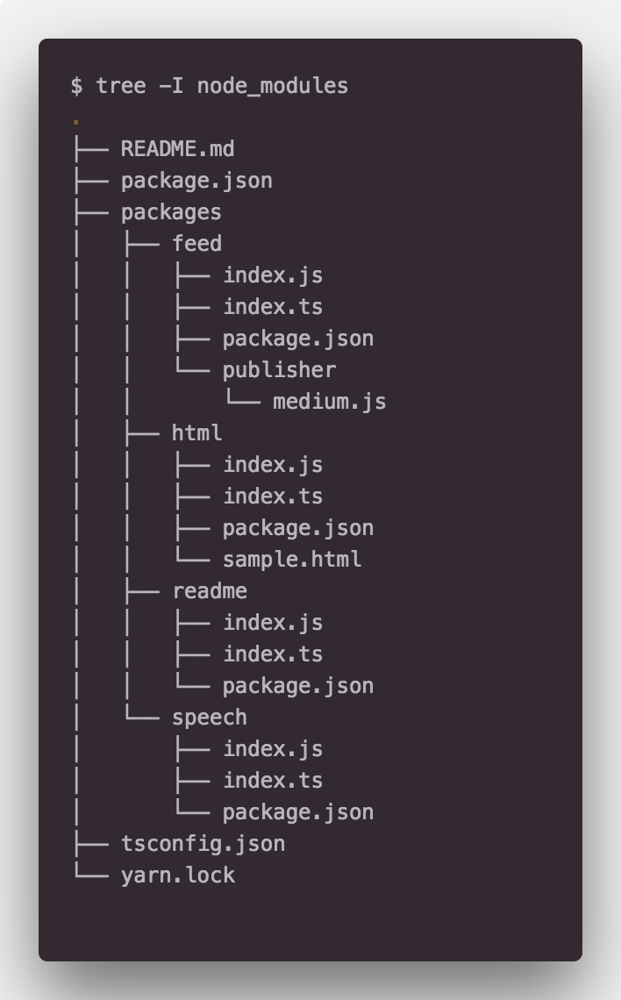

## TypeScript, Monorepo

타입스크립트와 모노레포 셋업은 매우 지난한 싸움이다. 맞지 않는 부분도 상당히 많다. 내가 일전에 무엇을 남겼는지 기억은 나지 않으나 비슷한 글을 남겼었다.

[🌸 모노레포. Lerna? Yarn Worksapce!](https://medium.com/@deptno/monorepo-yarn-workspace-e81e3e078100)

위 글에 모노레포가 왜 필요지에 대해서는 남겨 놨을 것이라 생각한다. 어떻게 셋업을 하는지 글을 남겼었지만 그럼에도 불구하고 타입스크립트를 마주하면 쉽지않은 상황이 발생한다. 특히 **프론트엔드**에서 그러하다.

프로젝트를 가볍게 생성한다고 해보자. 내가 자주 쓰는 Next.js 의 [빵판](https://github.com/deptno/next.js-typescript-starter-kit) 이나 아니면 그냥 `create-react-app` 에 `react-scripts-ts` 를 먹여서 TypeScript 로 프로젝트를 셋업하면 작업하는 내내 `.js` , `.map` 등은 더이상 밖으로 노출되지 않고 메모리안에서 처리된다. 때문에 우리는 `.gitignore` 를 따로 처리하면서 파일 IO에 대한 성능 이슈등으로 부터 자유롭다. 바람직하다.

## 그럼 무엇이 문제인가?

모노레포의 구성은 아래 사진과 유사하다.



이 이미지는 이전에 쓴 글에서 가져온 것인데 프론트엔드가 없는 라이브러리의 구현 구조다. 구조를 보면 `feed`, `html`, `readme`, `speech` 의 패키지가 존재한다. 편의상 `readme` 를 `create-react-app` 등으로 생성한 메인 **클라이언트 앱** 이라고 생각하자. 그럼 여기서 `packages/readme/index.js` 는 지워진다. 프로젝트 셋업에 따라 `.js`는 관리하지도 보여지지도 않는다.

나머지 패키지들은 컴파일의 결과로써 `.js` 을 유지해야한다. 각 패키지를 **리엑트 컴포넌트** 라고 생각하고 메인인 `readme` 에서 참조를 하게 되면 모노레포의 구성 이유와 같이 외부 모듈로 처리하므로 `import` 구문을 통해 로드시에 `.js` 가 로드되므로 반드시 `.js` 가 필요하다.

그럼 메인 프로젝트인 `readme` 는 컴파일을 따로 돌려서 `.js` 를 생성하면 안되고 나머지 패키지들에 대해서는 컴파일을 통해 `.js` 를 생성해야한다. 이 부분이 타입스크립트와 모노레포의 조합을 매우 어렵게 만든다. 부분마다 따로 컴파일을 돌리고 IDE 셋업에 매이는등 많은 삽질을 하다가 아마 그만뒀던 경험을 가진 개발자들도 여럿(나만? :eyes:)있을지 모르겠다.

## TypeScript 3

섹션이 하나 더 들어가야하는데 **시행착오**에 대해서 적을까 하다가 그에 대한 잘 씌여진 글로 대체한다. TypeScript 공식 사이트의 프로젝트 레퍼런스 핸드북과 후이서울에서 작성한 글이다.

- [https://engineering.huiseoul.com/타입스크립트-3-0-99e5d45ec439](https://engineering.huiseoul.com/타입스크립트-3-0-99e5d45ec439)
- https://www.typescriptlang.org/docs/handbook/project-references.html

모노레포에 관련된 글은 아니다. 그러나 프로젝트 빌드와 관련해서 인상적인 발전이 있었다. `--build` 명령어와 프로젝트 참조를 통해 순차적으로 효율적인 빌드를 적용한다 뭐 이런 내용인데 자세한 내용은 문서에 있다.

## Monorepo

그럼 다시 모노레포로 돌아오자.  `next` 나 `create-react-app` 의 개발환경이 돌면서 추가적으로 나머지 패키지들에서 빌드가 같이 돌아줘야한다. 나머지 패키지들은 컴파일을 통해서 `.js` 를 생산해 낼 것이고 메인 앱에서는 이들이 `.js` 를 가지고 있으므로 개발환경에서 바로바로 `import` 를 할 수 있게 된다.

드디어 추가된 타입스크립트@3 의 프로젝트 레퍼런스와 `--build` 를 통해 더러운 **프론트엔드 + 타입스크립트 + 모노레포** 가능해진다. 

이에 대한 설명은 글보다 코드로 대신한다.

- [Next.js 버전](https://github.com/deptno/typescript-monorepo-next-example)
- [create-react-app 버전](https://github.com/deptno/typescript-monorepo-cra-example)

------

등아파서 글을 길게 못쓰겠다...

> 💁 2018-09-05 추가 내용

### :shit: Package 간의 상호 참조 의존성

패키지간에 상호 참조가 필요한 경우 기존의 모노레포에서 하듯이 `package.json` 에 `[packageName]: "*"`이 동작하지 않았다. 대충 아래와 같은 에러가 난다.

```bash
npx tsc -b packages
error TS6307: File '경로/packages/패키지명/index.ts' is not in project file list. Projects must list all files or use an 'include' pattern.
```

`include` 라는 말에 휘둘려서 시간을 쫌 뺏겼는데 의존성이 없는 `pakcages/b` 는 컴파일이 되는 것을 보고 이것 저것 테스트를 해봤다.

`packages/a` 가 `packages/b` 에 대한 의존성을 지니고 있을 때 `packages/a` 의 `tsconfig.json` 에 레퍼런스를 추가해줘야지만 컴파일이 가능하다.

`packages/a/tsconfig.json` 에 `reference` 구문을 추가해주자

```json
"references": [
  { "path": "../b" }
]
```

그리고 다시 빌드한다.

```bash
tsx tsc -b packages
```