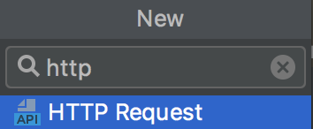

## 웹스톰(Webstorm)

IDE로 웹스톰을 사용하고 있다. 대단히 만족하는 프로그램 중에 하나로 딱히 세팅할게 없는게 장점 중 하나다. 그런데 디버깅에선 그렇지 않다.

## 디버깅 세팅

서버리스를 디버깅함에 있어 `npm scripts` 를 주로 사용하게 되는데 서버리스 오프라인에서는 디버그 모드가 동작하지 않는다. 세팅하기가 귀찮아서 그러려니 하고 살고 있었는데 반복적인 작업을 하게 되어 이 부분을 세팅하고 기록으로 남긴다.

#### NPM 스크립트

```json
{
  "scripts": {
    "start": "serverless offline --port 3001",
    "test": "echo \"Error: no test specified\" && exit 1"
  }
}
```

`package.json` 은 보통 위와 같이 설정한데 풀 스택으로 작업을 할때는 3000 포트가 겹치기 때문에 포트 인자를 줘서 바꾼다.

> :information_desk_person: `-p 3001` 하면 `  this.options.prefix.startsWith is not a function` 이 따위 에러가 나게 되니 조심하자. `-p` 옵션은 포트가 아닌 프리픽스에 대한 옵션이다.

### NPM 스크립트에서는 디버그가 동작하지 않는다.

이 부분이 살짝 놀라웠는데 여튼 안되는거다. `npm scripts` 대신 직접 환경을 구성해야한다. 구성 자체는 간단하니 따라서 세팅하도록 한다.

#### 디버그 메뉴 진입

메뉴 진입은 우상단의 툴바나 메뉴바에서 찾아 들어가면된다.


#### 설정


메뉴에 진입하면 나오는 화면이다. 왼쪽에서 `+` 를 눌러 `Node.js` 를 선택한뒤 이미지와 같이 설정을 해주면된다. 이름은 알아보기 편한 놈으로 정한다.

- **Working directory:**  `package.json` 이 존재하는 루트 프로젝트에 있으면된다.
- **JavaScript file: ** 실행은 `serverless` 를 통해서 진행되므로 이에 대한 경로를 설정하면 된다. 난 로컬 설치를 했기 때문에 `node_modules/.bin/serverless` 를 참조한다. 글로벌을 통해서 관리하는 사람은 터미널에서 `which serverless` 를 통해 나오는 경로를 넣어주면된다.
- **Application parameters:** `offline` 이면 충분하다. 포트를 변경하기 위해 난 `--port 3001` 을 추가적으로 입력했다.


## 디버깅


버전업이 되면서 아이콘이 좀 플랫하게 바꼈는데 여튼 맨 오른쪽이 디버그 아이콘이다.


웹에서 디버깅과 마찬가지로 `debugger` 와 브레이크 포인트가 둘다 작동한다 브레이크 포인트는  `CMD + F8` 를 통해 라인에 대해서 토글이 가능하다.

### HTTP Request

>  :information_desk_person:웹스톰은 **Restful API Client** 를 자체적으로 가지고 있지만 개인적으론 불편해서 다른 클라이언트도 잘 안쓴다. `.http` 파일을 이용하면 편하게 HTTP 요청을 **코드로 관리** 가 가능하다.

프로젝트(디렉토리) 뷰에 `HTTP Request` 파일을 추가하자.



그럼 친절하게 스니펫 까지 적힌 파일이 생성된다.


보는 바와 같이 결과도 신택스 하이라이팅을 해준다. :hand: